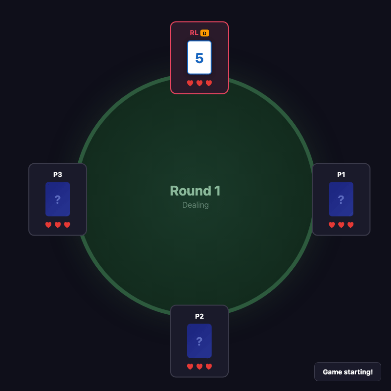

# Cucù Reinforcement Learning

**Discovering optimal strategies for the traditional Italian card game through reinforcement learning.**

<p align="center">
  
</p>

## Table of Contents

- [Overview](#overview)
- [The Game of Cucù](#the-game-of-cucù)
- [Probability Analysis](#probability-analysis)
- [Reinforcement Learning Approach](#reinforcement-learning-approach)
- [Installation](#installation)
- [Usage](#usage)
- [Project Structure](#project-structure)
- [Results](#results)
- [References](#references)

## Overview

This project applies **Proximal Policy Optimization (PPO)** to learn optimal strategies for Cucù, a traditional Italian card game with incomplete information. The goal is to answer fundamental questions about the game:

1. What is the optimal card threshold for swapping based on position?
2. How does the number of players affect optimal strategy?
3. Can a learned agent outperform simple heuristic strategies?
4. Is there a dominant strategy, or does optimal play depend on game state?

## The Game of Cucù

Cucù (also known as "Cucco" or "Gnao") is a traditional Italian card game dating back to the 16th century. It's a game of survival where players try to avoid holding the lowest card.

### Rules

**Setup:**
- 4-20 players sit in a circle
- Each player starts with 3 lives
- A special 40-card Cucù deck is used (cards valued 1-10)
- One player is designated as the dealer (rotates each round)

**Card Values (lowest to highest):**
| Value | Card | Special Effect |
|-------|------|----------------|
| 1 | Ace (Cucù) | Lowest - most dangerous |
| 2-7 | Number cards | No special effect |
| 8 | Jack | No special effect |
| 9 | Horse | **Passes** swap to next player |
| 10 | King | **Blocks** swap entirely |

**Gameplay:**
1. Each player receives one face-down card
2. Starting from the player to the dealer's right, each player decides:
   - **STAY**: Keep their card
   - **SWAP**: Request to exchange with the next player
3. When swapping:
   - If the next player has a **King**: Swap is blocked
   - If the next player has a **Horse**: Swap passes to the next player
   - Otherwise: Cards are exchanged
4. The **dealer** (last to act) can swap with the deck:
   - Drawing a King = instant life loss
5. All cards are revealed; player(s) with the **lowest** card lose a life
6. Players with 0 lives are eliminated
7. Last player standing wins

### Strategic Depth

Despite simple rules, Cucù has surprising strategic depth:
- **Positional advantage**: Later positions see more information
- **Incomplete information**: You only know your own card
- **Inference**: Opponent actions reveal information about their cards
- **Risk management**: Swapping can improve or worsen your position

## Probability Analysis

### Baseline Win Probability

In a game with $n$ players making random decisions:

$$P(\text{win}) = \frac{1}{n}$$

For a 4-player game, the baseline win rate is **25%**.

### Card Distribution Analysis

With a standard Cucù deck:
- **Dangerous cards** (1-3): 30% of deck - high swap incentive
- **Medium cards** (4-7): 40% of deck - context-dependent
- **Safe cards** (8-10): 30% of deck - always stay

### Optimal Threshold Strategy

Monte Carlo simulations reveal that a simple **threshold strategy** performs well:

> "Swap if card value < threshold, otherwise stay"

| Threshold | Win Rate (4 players) | Analysis |
|-----------|---------------------|----------|
| 3 | ~24% | Too aggressive |
| 4 | ~25% | Slightly aggressive |
| **5** | **~26%** | **Near-optimal** |
| 6 | ~25% | Slightly conservative |
| 7 | ~24% | Too conservative |

The optimal threshold of **5** aligns with the median card value, suggesting a "swap if below average" heuristic is effective.

### Position Effects

Position significantly impacts win probability:

| Position | Description | Advantage |
|----------|-------------|-----------|
| First | No information | Baseline |
| Middle | Partial information | +1-2% |
| Dealer | Full information + deck option | +3-5% |

## Reinforcement Learning Approach

### Architecture

```
Environment (PettingZoo AEC) → Multi-Agent Wrapper → PPO + Action Masking → Trained Policy
```

### State Representation

The agent observes a 12-dimensional feature vector:

| Feature | Description | Normalization |
|---------|-------------|---------------|
| Card value | Current card (1-10) | /10 |
| Turn position | Position in turn order | /20 |
| Is dealer | Binary flag | 0/1 |
| Players remaining | Active players | /20 |
| Total players | Table size | /20 |
| My lives | Remaining lives | /3 |
| Swaps before me | Count of swaps | /20 |
| Actions before me | Total actions | /20 |
| Last action swap | Previous player swapped | 0/1 |
| Swap ratio | Ratio of swaps | 0-1 |
| Was swapped on | Received a swap | 0/1 |
| Card before swap | Original card value | /10 |

### Action Masking

Domain knowledge is encoded via action masking:

1. **Force STAY** if holding King, Horse, or Jack (value ≥ 8)
2. **Force STAY** if swapped upon and received a better card

This reduces the action space and prevents obviously suboptimal actions.

### PPO Hyperparameters

| Parameter | Value | Description |
|-----------|-------|-------------|
| Learning rate | 3e-4 | Adam optimizer |
| Clip epsilon | 0.2 | PPO clipping |
| Gamma | 0.99 | Discount factor |
| GAE lambda | 0.95 | Advantage estimation |
| Entropy coef | 0.05 | Exploration bonus |
| Value coef | 0.5 | Value loss weight |
| Rollout steps | 2048 | Steps per update |

### Training Curriculum

Training uses curriculum learning:

1. **Phase 1** (0-50% episodes): Mixed random/threshold opponents
2. **Phase 2** (50-100%): Primarily threshold-5 opponents
3. **Variable table sizes**: Random 4-8 players per episode

## Installation

### Prerequisites

- Python 3.10+
- pip or conda

### Clone Repository

```bash
git clone https://github.com/SilvioBaratto/cucu-reinforcement-learning.git
cd cucu-reinforcement-learning
```

### Install Dependencies

**Option 1: pip**
```bash
pip install -e .
```

**Option 2: conda**
```bash
conda create -n cucu_rl python=3.12
conda activate cucu_rl
pip install -e .
```

**Option 3: requirements.txt**
```bash
pip install -r requirements.txt
pip install -e .
```

## Usage

The project provides a CLI tool `cucu` for all operations:

### Quick Start

```bash
# Show system information
cucu info

# Evaluate the pre-trained model
cucu evaluate --model models/best_model.pt --games 1000

# Render a game visualization
cucu render --output game.gif
```

### Commands

#### Monte Carlo Simulation

Find optimal threshold strategies through simulation:

```bash
cucu monte-carlo --games 10000 --players 4
```

Options:
- `--games`: Number of games to simulate (default: 10000)
- `--players`: Number of players (default: 4)
- `--seed`: Random seed for reproducibility

#### Train PPO Agent

Train a new agent using self-play:

```bash
# Full training
cucu train --episodes 100000 --device cpu

# Quick test
cucu train --episodes 1000 --eval-freq 100 --save-freq 500

# Resume from checkpoint
cucu train --episodes 100000 --resume models/checkpoint_50000.pt
```

Options:
- `--episodes`: Training episodes (default: 100000)
- `--min-players`: Minimum table size (default: 4)
- `--max-players`: Maximum table size (default: 8)
- `--rollout-steps`: Steps before PPO update (default: 2048)
- `--eval-freq`: Evaluation frequency (default: 1000)
- `--save-freq`: Checkpoint frequency (default: 10000)
- `--device`: Training device, cpu or cuda (default: cpu)
- `--resume`: Path to checkpoint to resume from

#### Evaluate Agent

Test trained agent against different opponents:

```bash
cucu evaluate --model models/best_model.pt --games 1000 --players 4
```

Options:
- `--model`: Path to trained model (default: models/best_model.pt)
- `--games`: Games per opponent type (default: 5000)
- `--players`: Number of players (default: 4)
- `--device`: Inference device (default: cpu)

**Interpreting Results:**

| Win Rate vs Expected | Interpretation |
|---------------------|----------------|
| > +5% | Strong performance |
| +1% to +5% | Good performance |
| -1% to +1% | Neutral (baseline) |
| < -1% | Underperforming |

#### Render Visualization

Create animated game visualizations:

```bash
# GIF output (default)
cucu render --output game.gif

# MP4 output
cucu render --output game.mp4

# Keep frame images
cucu render --keep-frames
```

Options:
- `--model`: Model to visualize (default: models/best_model.pt)
- `--output`: Output file path (default: game_visualization.gif)
- `--players`: Number of players (default: 4)
- `--fps`: Frames per second (default: 5)
- `--seed`: Random seed for reproducibility
- `--keep-frames`: Keep individual frame images

## Project Structure

```
cucu-reinforcement-learning/
├── cucu_rl/                    # CLI package
│   ├── __init__.py
│   └── cli.py                  # Main CLI application
├── src/
│   ├── __init__.py
│   ├── cucu_env.py             # PettingZoo environment
│   ├── cards.py                # Card definitions
│   ├── agents/                 # Agent implementations
│   │   ├── base_agent.py       # Abstract base class
│   │   ├── random_agent.py     # Random baseline
│   │   ├── threshold_agent.py  # Heuristic strategy
│   │   └── rl_agent.py         # PPO agent wrapper
│   ├── models/                 # Neural network models
│   │   ├── actor_critic.py     # Policy/Value network
│   │   ├── ppo.py              # PPO algorithm
│   │   ├── replay_buffer.py    # Experience storage
│   │   └── gae.py              # Advantage estimation
│   ├── multi_agent.py          # Multi-agent wrapper
│   └── utils/                  # Utilities
│       ├── logger.py           # TensorBoard logging
│       └── metrics.py          # Evaluation metrics
├── training/                   # Training scripts
│   ├── monte_carlo.py          # Phase 1: Baseline discovery
│   ├── self_play.py            # Phase 2: PPO training
│   └── evaluate.py             # Phase 3: Analysis
├── visualization/              # Rendering
│   ├── render_game.py          # Game visualization
│   └── utils.py                # CSS and helpers
├── models/                     # Saved models
│   └── best_model.pt           # Pre-trained model
├── results/                    # Training logs
├── pyproject.toml              # Package configuration
├── requirements.txt            # Dependencies
└── README.md
```

## Results

### Training Performance

After 100,000 episodes of self-play training:

| Metric | Value |
|--------|-------|
| Best win rate (eval) | ~18% |
| Training time | ~4 minutes (CPU) |
| Model size | ~50 KB |

### Evaluation Against Baselines

| Opponent | RL Agent Win Rate | vs Random Baseline |
|----------|-------------------|-------------------|
| Random | ~37% | +12% |
| Threshold-3 | ~24% | -1% |
| Threshold-5 | ~20% | -5% |
| Threshold-7 | ~25% | ±0% |

### Key Findings

1. **Threshold-5 is hard to beat**: Simple heuristics are surprisingly effective in Cucù
2. **Position matters**: The dealer position provides significant advantage
3. **High variance**: Card luck dominates short-term outcomes
4. **Learned behaviors**:
   - Agent learns to always stay with high cards (8+)
   - Learns position-dependent swap thresholds
   - Adapts strategy based on observed swaps

## License

MIT License - see LICENSE file for details.

## Author

**Silvio Baratto** - [GitHub](https://github.com/SilvioBaratto)
